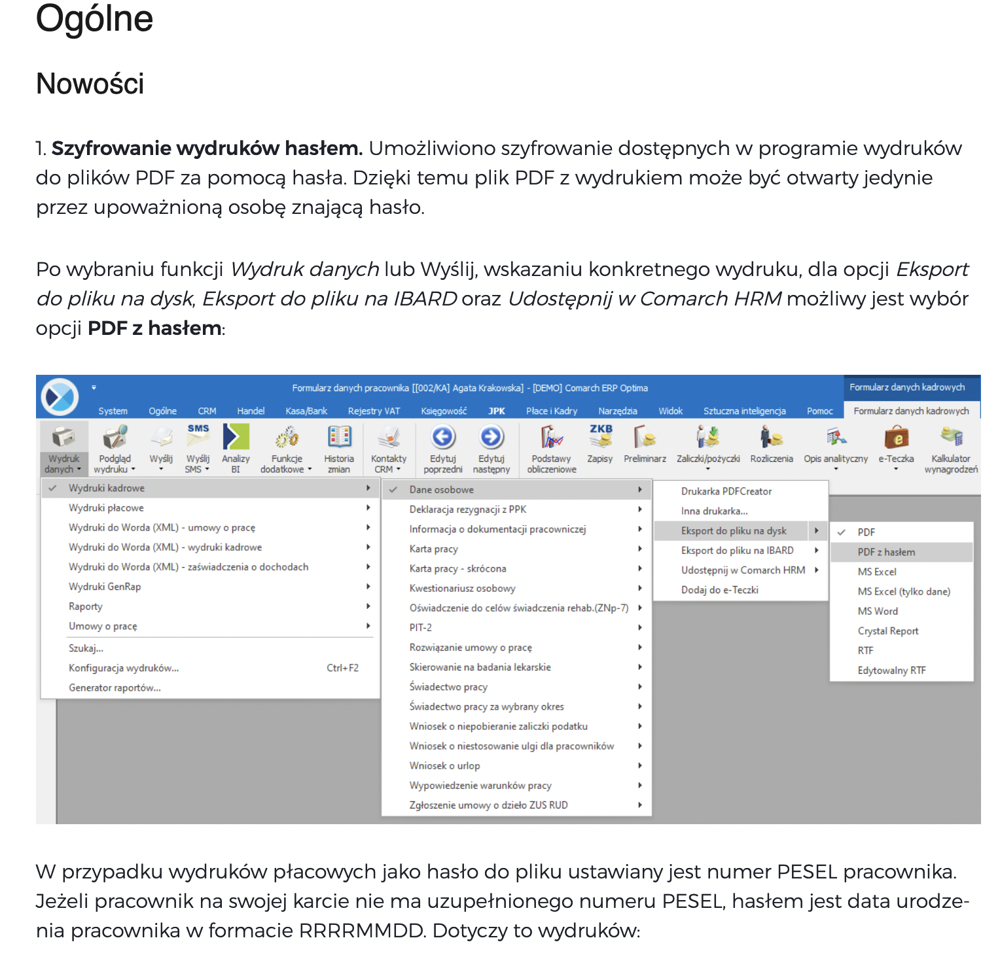

Gremlin
=======

This is small proof of concept to crack any PDF file encrypted with PESEL number as password. One of my last PIT received in my job was encrypted by PESEL number and it occurred to me that this is a default feature of Comarch Optima software. Given that space of PESEL numbers is predictable for working people I thought it's very easy to get actually crack any PIT file (or other file encrypted by Comarch Optima). For people without pesel number it's encrypted just with they date of birth. You can read more about this feature here: https://pomoc.comarch.pl/optima/pl/2022/index.php/dokumentacja/ogolne-i-kasa-bank-20/.

In worst case scenarion doing bruteforce if we take into account all people from 18-67 (retirement age) and that ordinal number was actually random there is around 178832115 PESEL numbers that has to be checked. 

Before you run it please download all dependencies

    go mod download

To use it just run

    go run main.go /PathFile/To/Pdf/File
